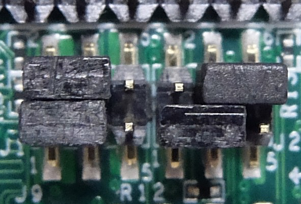

Android Things 有两个官方支持的版本，一个是 `NXP i.MX7D`，另一个是 `Raspberry Pi`。后者没有什么可说的，主要是前者应该当如何安装。

主要参考了[这个文章](https://www.digikey.com/eewiki/display/linuxonarm/PICO-PI-IMX7)

## Toolchain

我们需要的有：`imx_usb_loader`，`ARM Cross Compiler: GCC`，`Bootloader: U-Boot`

### imx\_usb\_loader

```shell
git clone https://github.com/boundarydevices/imx_usb_loader
cd imx_usb_loader/
make
```

### ARM Cross Compiler: GCC

在[这里](https://www.linaro.org/downloads/)找最新的 ARM GCC 交叉编译编译器。

写这篇文章时最新的为7.5.0

```shell
wget -c https://releases.linaro.org/components/toolchain/binaries/latest-7/arm-linux-gnueabihf/gcc-linaro-7.5.0-2019.12-x86_64_arm-linux-gnueabihf.tar.xz
tar xf gcc-linaro-7.5.0-2019.12-x86_64_arm-linux-gnueabihf.tar.xz
export CC=`pwd`/gcc-linaro-7.5.0-2019.12-x86_64_arm-linux-gnueabihf/bin/arm-linux-gnueabihf-
```

测试一下交叉编译器：

```shell
${CC}gcc --version
```

### Bootloader: U-Boot

在 https://github.com/u-boot/u-boot 上找最新的分支，写文章时为`v2020.10-rc4`。

```shell
git clone -b v2020.10-rc4 https://github.com/u-boot/u-boot --depth=1
cd u-boot/
```

编译 u-boot

```shell
make ARCH=arm CROSS_COMPILE=${CC} distclean
make ARCH=arm CROSS_COMPILE=${CC} pico-pi-imx7d_defconfig
make ARCH=arm CROSS_COMPILE=${CC}
```

## 从 U-BOOT 启动

### 设置跳线

跳线的具体设置可以参考这里：https://www.technexion.com/support/knowledgebase/boot-configuration-settings-for-pico-baseboards/

我们需要设置为 USB Boot 启动，即跳线设置为


:::note
板子上有两个跳线连接的地方，要注意应该修改哪个地方
:::

```shell
lsusb | grep Freescale
# Output: Bus 00x Device 00y: ID 15a2:0076 Freescale Semiconductor, Inc
```

:::caution Notes
如果没有从 usb 启动，不会有 Freescale 的设备，设备的 ID 也是无法对应上的。

如果使用的是 emmc 启动，即 Android，那么显示的是 Google Inc. 的设备，以及设备 ID 将是 18d1:4ee7
:::

### 使用 USB 加载镜像

加载 SPL

```shell
sudo ~/imx_usb_loader/imx_usb SPL
```

加载 u-boot-dtb.img

```shell
sudo ~/imx_usb_loader/imx_usb u-boot-dtb.img
```

:::note 启动串口
在加载 u-boot-dtb.img 之前，需要打开另一个窗口，打印出串口的内容。
:::

:::important 串口设置
可以使用 minicom 进行连接

串口配置：115200, 8N1, 无硬件、软件流控制

**要将硬件流控制关掉，否则将无法输入，也无法跳过 autostart**
:::

:::important 避免 autostart
并且，在 u-boot-dtb.img 加载之后，会立即启动，需要在串口中快速地按下任意键以避免 autostart。

```text
Loading Environment from MMC... OK
In:    serial
Out:   serial
Err:   serial
Net:   FEC0
Hit any key to stop autoboot:  0
=>
```
:::

### 将 u-boot 写入 emmc

在前面按下任意键后，会进入 u-boot 命令行，在串口中依次执行

```text
=> env default -f -a
=> setenv bootm_boot_mode nonsec
=> saveenv
```

:::note
以 `=>` 开头的为在串口中执行

反之为在 `shell` 中执行
:::

将 mmc 0 设置为从数据分区启动，而不是从 boot 分区启动

```text
=> mmc partconf 0 0 7 0
```

进入 DFU 模式

```text
=> dfu 0 mmc 0
```

刷入 SPL，需要安装 dfu-util

```shell
sudo dfu-util -D SPL -a spl
```

刷入 u-boot-dtb.img

```shell
sudo dfu-util -R -D u-boot-dtb.img -a u-boot
```

### 从 emmc 启动

拔掉电源，将跳线设置为 emmc 启动。

跳线如图：



加电之后，启动板子，进入 u-boot，这里不需要跳过 autoboot

```text
Loading Environment from MMC... OK
In:    serial
Out:   serial
Err:   serial
Net:   FEC0
Hit any key to stop autoboot:  0
=>
```

启动 USB 存储模式

```text
=> ums 0 mmc 0
```

之后会卡住，操作在电脑上完成

:::note GPT
可能出现 GPT 分区头部 CRC 校验错误，可以忽略
:::

## Linux Kernel

下载 kernel、modules、device tree

```shell
git clone https://github.com/RobertCNelson/armv7-lpae-multiplatform
cd armv7-lpae-multiplatform/
```

切换到对应分支以选择相应的内核

```shell
git checkout origin/v5.4.x -b tmp
```

编译内核

```shell
./build_kernel.sh
```

这个脚本会生成内核、模块以及设备树

在结束后，脚本会显示

```text
-----------------------------
Script Complete
eewiki.net: [user@localhost:~$ export kernel_version=5.X.Y-Z]
-----------------------------
```

记录 kernel_version，并执行

```shell
export kernel_version=5.X.Y-Z
```

## Rootfs

在 https://rcn-ee.com/rootfs/eewiki/minfs/ 找到 debian 或者 ubuntu 对应的 rootfs

ubuntu 的默认账号密码为：

| 账号   | 密码    |
| ------ | ------- |
| ubuntu | temppwd |

debian 的默认账号密码为：

| 账号   | 密码    |
| ------ | ------- |
| debian | temppwd |

以 debian 为例子

```
wget -c https://rcn-ee.com/rootfs/eewiki/minfs/debian-10.5-minimal-armhf-2020-08-24.tar.xz
```

解压

```
tar xf debian-10.5-minimal-armhf-2020-08-24.tar.xz
```

## 设置本地存储

使用 `lsblk` 确定上文中，emmc 的 usb 模式对应的磁盘，为 `/dev/sdb` 或 `/dev/mmcblk0` 或类似

设置为环境变量：

```shell
export DISK=/dev/sdb
# 或
export DISK=/dev/mmcblk0
```

### 清空分区表

```shell
sudo dd if=/dev/zero of=${DISK} bs=1M count=10
```

### 将 SPL 和 u-boot-dtb.img 写入到 EMMC 中

```shell
sudo dd if=./u-boot/SPL of=${DISK} seek=1 bs=1k
sudo dd if=./u-boot/u-boot-dtb.img of=${DISK} seek=69 bs=1k
```

### 创建分区表

对于 `sfdisk` 版本大于等于 2.26.x

```shell
sudo sfdisk ${DISK} <<-EOF
1M,,L,*
EOF
```

对于 `sfdisk` 版本小于等于 2.25.x

```shell
sudo sfdisk --unit M ${DISK} <<-EOF
1,,L,*
EOF
```

### 格式化

使用 `sfdisk` 查看 `type` 为 `part` 的分区，如 `/dev/sdb1` 或 `/dev/mmcblk0p1`

格式化为 ext4

```shell
sudo mkfs.ext4 -L rootfs /dev/sdb1
# 或
sudo mkfs.ext4 -L rootfs /dev/mmcblk0p1
```

### 挂载

```shell
sudo mkdir -p /media/rootfs/

sudo mount /dev/sdb1 /media/rootfs/
# 或
sudo mount /dev/mmcblk0p1 /media/rootfs/
```

### 复制 rootfs

```shell
sudo tar xfvp ./debian-*-*-armhf-*/armhf-rootfs-*.tar -C /media/rootfs/
sync
sudo chown root:root /media/rootfs/
sudo chmod 755 /media/rootfs/
```

### 设置 extlinux.conf

```shell
sudo mkdir -p /media/rootfs/boot/extlinux/
sudo sh -c "echo 'label Linux ${kernel_version}' > /media/rootfs/boot/extlinux/extlinux.conf"
sudo sh -c "echo '    kernel /boot/vmlinuz-${kernel_version}' >> /media/rootfs/boot/extlinux/extlinux.conf"
sudo sh -c "echo '    append root=/dev/mmcblk2p1 ro rootfstype=ext4 rootwait quiet' >> /media/rootfs/boot/extlinux/extlinux.conf"
sudo sh -c "echo '    fdtdir /boot/dtbs/${kernel_version}/' >> /media/rootfs/boot/extlinux/extlinux.conf"
```

### 复制 Linux 内核、设备树和模块

```shell
sudo cp -v ./armv7-lpae-multiplatform/deploy/${kernel_version}*.zImage /media/rootfs/boot/vmlinuz-${kernel_version}
sudo mkdir -p /media/rootfs/boot/dtbs/${kernel_version}/
sudo tar xfv ./armv7-lpae-multiplatform/deploy/${kernel_version}-dtbs.tar.gz -C /media/rootfs/boot/dtbs/${kernel_version}/
sudo tar xfv ./armv7-lpae-multiplatform/deploy/${kernel_version}-modules.tar.gz -C /media/rootfs/
```

### File Systems Table (/etc/fstab)

```shell
sudo sh -c "echo '/dev/mmcblk2p1  /  auto  errors=remount-ro  0  1' >> /media/rootfs/etc/fstab"
```

### umount & exit

umount 挂载的盘

```shell
sync
sudo umount /media/rootfs
```

u-boot 退出 usb 挂载 emmc 模式

```
Loading Environment from MMC... OK
In:    serial
Out:   serial
Err:   serial
Net:   FEC0
Hit any key to stop autoboot:  0
=> ums 0 mmc 0
UMS: LUN 0, dev0, hwpart 0, section 0x0, count 0x720000
Ctrl+C to exit ...
=> reset
```

## 启动设备

默认的账户与密码在下载 rootfs 中有提到

## 启用另一个 CPU

使用 `sudo lshw` 列出硬件信息，可以看出有一个 CPU 内核被禁用，这是由于使用安全模式加载了主线内核的原因

可以在启动的时候在串口命令中输入

```text
=> env default -f -a
=> setenv bootm_boot_mode nonsec
=> saveenv
```

之后再 `reset` 重新启动，重新使用 `lshw`，可以看出 cpu1 也启用了

```text
*-core
       description: Motherboard
       physical id: 0
     *-cpu:0
          description: CPU
          product: cpu
          physical id: 0
          bus info: cpu@0
          size: 996MHz
          capabilities: half thumb fastmult vfp edsp thumbee neon vfpv3 tls vfpv4 idiva idivt vfpd32 lpae evtstrm
     *-cpu:1
          description: CPU
          product: cpu
          physical id: 1
          bus info: cpu@1
          size: 996MHz
          capabilities: half thumb fastmult vfp edsp thumbee neon vfpv3 tls vfpv4 idiva idivt vfpd32 lpae evtstrm
     *-cpu:2 DISABLED
          description: CPU
          product: idle-states
          physical id: 2
          bus info: cpu@2
     *-memory
          description: System memory
          physical id: 3
          size: 422MiB
```

:::note PSCI
理论上，可以通过启用 PSCI 来实现使用安全模式下仍然可以使用另一个 CPU
:::

## WLAN

安装完后，仍然只能使用 LAN 联网，`ip a`下面无法出现 wlan0。

通过 `dmesg` 可以检查到 brcmfmac 的驱动启动时缺少 `brcmfmac4339-sdio.txt` 和 `brcmfmac4339-sdio.technexion,imx7d-pico-pi.txt` 两个文件。

在[网络](https://fossies.org/linux/buildroot/board/technexion/imx7dpico/rootfs_overlay/lib/firmware/brcm/brcmfmac4339-sdio.txt)上可以找到 `brcmfmac4339-sdio.txt` 文件，将其放进 `/lib/firmware/bcrm` 目录下，重启。

使用 `ip a` 可以看到

```text
wlan0: <NO-CARRIER,BROADCAST,MULTICAST,DYNAMIC,UP> mtu 1500 qdisc pfifo_fast state DOWN group default qlen 1000
   link/ether b0:f1:ec:xx:xx:xx brd ff:ff:ff:ff:ff:ff
```

不过现在还不知道怎么把这个网卡 UP 起来
