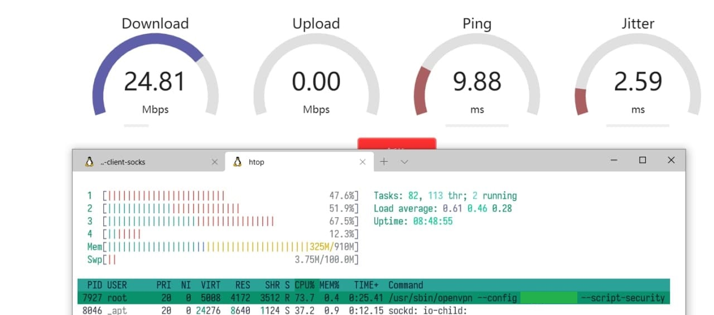
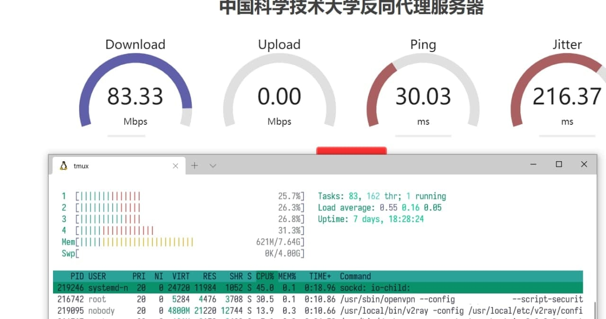

## OpenVPN 转 SOCKS

### 安装

使用 [docker-openvpn-client-socks](https://github.com/kizzx2/docker-openvpn-client-socks)

可以直接 `./start PATH-TO-OVPN-CONF` 启动，或者修改 `start`

```shell
#!/bin/sh

exec docker run \
    --rm \
    --device=/dev/net/tun \
    --name=openvpn-client \
    --cap-add=NET_ADMIN \
    --publish 127.0.0.1:1080:1080 \
    --volume "$(realpath "$1"):/etc/openvpn/:ro" \
    --sysctl net.ipv6.conf.all.disable_ipv6=0 \
    openvpn-client-socks
```

其中，去掉了要求 tty 的参数，便于添加为 systemd 服务

使用 docker build 镜像

```shell
docker build . -t openvpn-client-socks
```

之后就可以使用 curl 进行测试

```shell
export http_proxy="socks://localhost:9050"
export https_proxy=$http_proxy
curl https://github.com -vvvv --head
```

### 备注

最好在一个新的文件夹下面放置 OpenVPN 的文件，并且后缀名是 conf 而不是 ovpn

在 OpenVPN 的配置文件中的 `dev` 选项中，要将 tun 设备名设置为 `tun0`，与 `sockd.conf` 中的 `external` 相匹配

## SOCKS to Shadowsocks

由于使用的是 v2ray，可以转成任意的协议

配置参考

```conf
{
  "inbounds": [
    {
      "port": 16823,
      "protocol": "shadowsocks",
      "settings": {
        "method": "aes-128-gcm",
        "password": "password",
        "level": 0,
        "ota": false,
        "network": "tcp"
      }
    }
  ],
  "outbounds": [
    {
      "protocol": "socks",
      "settings": {
        "servers": [
          {
            "address": "127.0.0.1",
            "port": 9050
          }
        ]
      }
    }
  ]
}
```

## 后记

性能要求有点高

### Pi 3b

使用树莓派 3B 跑这一套流程，v2ray 会有极高的延迟，但是直连 SOCKS 就没有问题。速度比较慢，很容易跑满树莓派的 CPU

vless -> socks -> openvpn


socks -> openvpn



### x86

在一台 i5-4590 机器上跑

shadowsocks -> socks -> openvpn



可能需要优化，但是本身 `openvpn` 服务以及 `sockd` 服务占用的资源就已经比较多了
